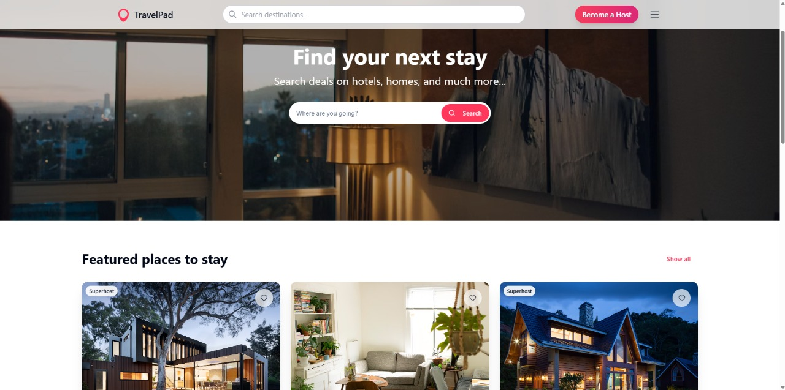
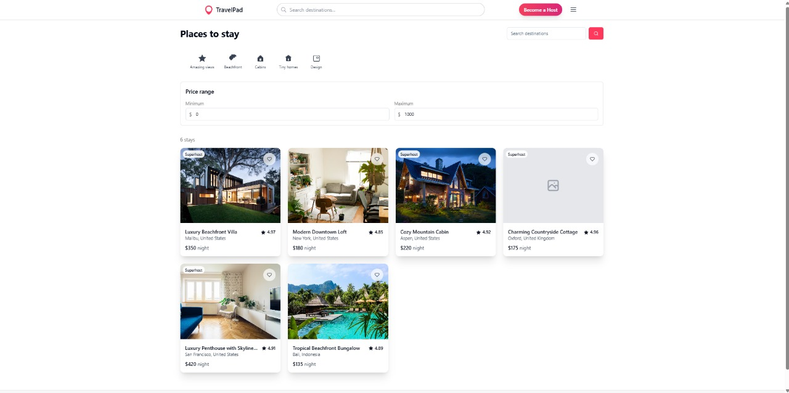
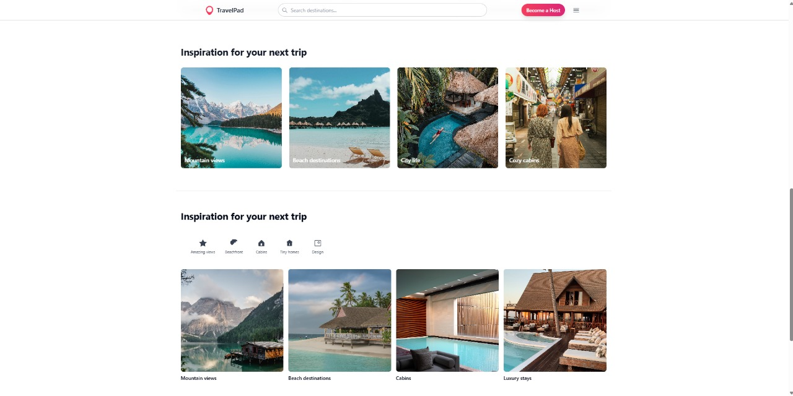

# 🏠 TravelPad

A modern accommodation booking platform built with React and TypeScript.

## 📸 Screenshots

### Home Page Hero


### Featured Properties


### Property Listings


### Category Navigation


### Travel Inspiration


### Explore Categories


## ✨ Key Features

- 🔍 Advanced property search and filtering
- 📅 Real-time availability calendar
- 💳 Secure booking system
- ❤️ Wishlist functionality
- 📱 Fully responsive design
- 🌍 Location-based search
- 🏷️ Dynamic pricing
- ⭐ Rating and review system

## 🛠️ Tech Stack

- ⚛️ React
- 📘 TypeScript
- 🎨 Tailwind CSS
- 🔄 React Router
- ✨ Framer Motion
- 🎯 Radix UI

## 🚀 Getting Started

```bash
# Clone the repository
git clone https://github.com/ayush/travel-pad.git

# Install dependencies
npm install

# Start development server
npm run dev
```

## 📱 Features Showcase

### Property Discovery
- Advanced filtering options
- Real-time search
- Category-based browsing
- Location-based results

### Booking Experience
- Interactive calendar
- Guest selection
- Instant pricing
- Booking confirmation

### User Features
- Wishlist management
- Property reviews
- Host messaging
- Profile management

## 🔧 Core Components

### Search and Navigation
- Dynamic search bar
- Category filters
- Location selection
- Date picker

### Property Display
- Image galleries
- Amenity lists
- Pricing calculator
- Availability calendar

### Booking System
- Guest selection
- Date range picker
- Price breakdown
- Instant booking

## 📄 License

MIT License - see LICENSE for details

## 📁 Project Structure

## 🎯 Key Components

- **FilterBar**: Category-based property filtering
- **PropertyCard**: Property listing card with image carousel
- **ReservationCard**: Booking interface with calendar
- **Navbar**: Navigation and search interface
- **PropertyDetail**: Detailed property view

## 🔧 Configuration

The project uses several configuration files:

- `vite.config.ts` - Vite configuration
- `tailwind.config.ts` - Tailwind CSS configuration
- `tsconfig.json` - TypeScript configuration

## 🤝 Contributing

Contributions are welcome! Please feel free to submit a Pull Request.

1. Fork the project
2. Create your feature branch (`git checkout -b feature/AmazingFeature`)
3. Commit your changes (`git commit -m 'Add some AmazingFeature'`)
4. Push to the branch (`git push origin feature/AmazingFeature`)
5. Open a Pull Request

## 📝 License

This project is licensed under the MIT License - see the [LICENSE](LICENSE) file for details.

## 👏 Acknowledgments

- Design inspired by Airbnb
- Icons from Heroicons and Lucide
- UI components from Radix UI
- Calendar functionality from react-day-picker

## 📫 Contact

Your Name - _ayushhpandeyy_

Project Link: [https://github.com/yourusername/travel-pad-genesis](https://github.com/yourusername/travel-pad-genesis)
